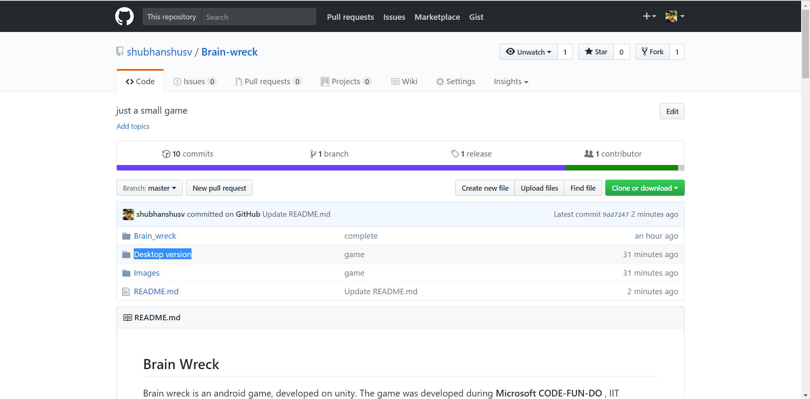
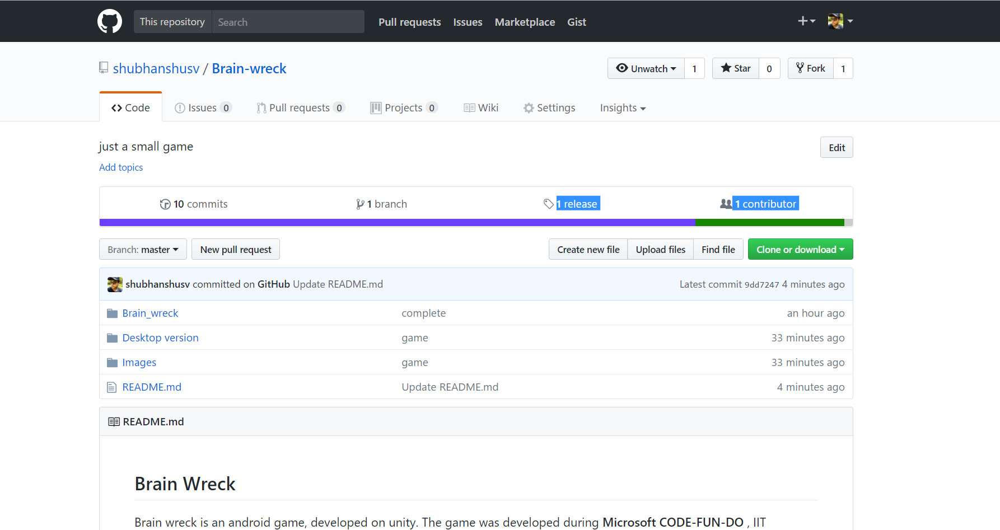
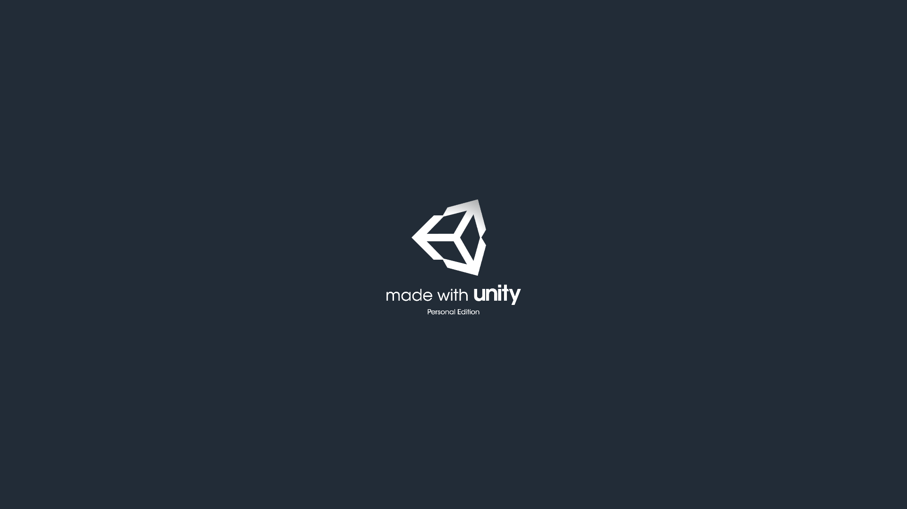
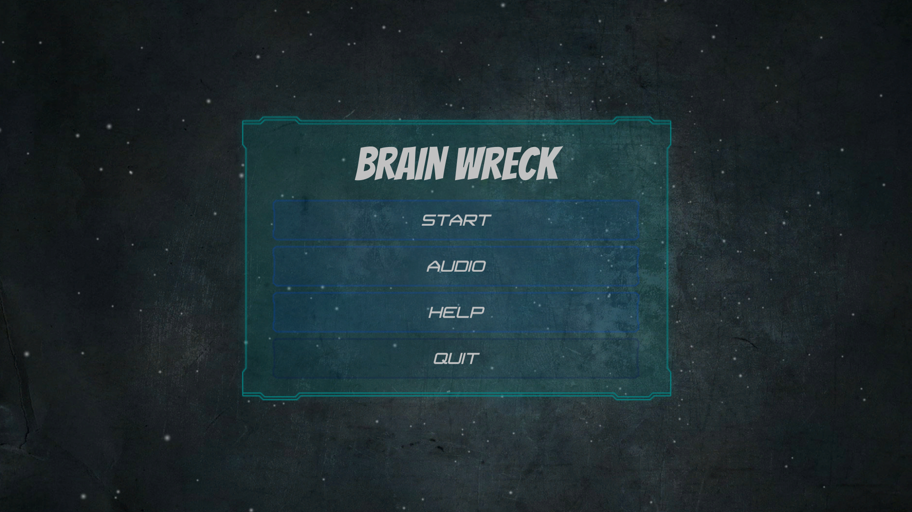
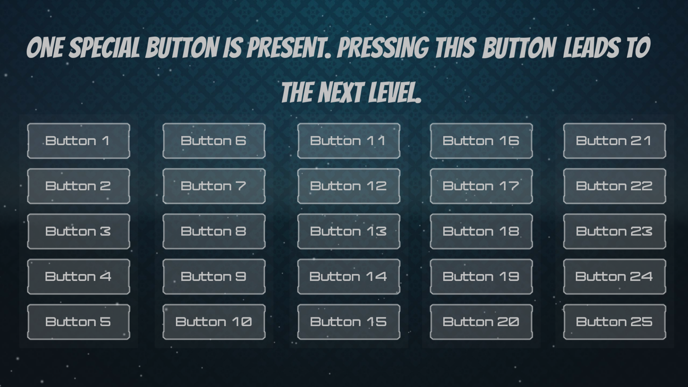
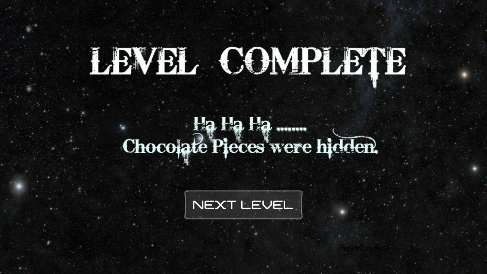

## Brain Wreck

Brain wreck is an android game, developed on unity. The game was developed during **Microsoft CODE-FUN-DO** , IIT Guwahati campus round.

### Overview

The game comprises of 10 levels based on presence of mind and general common sense. The player needs to complete present level in order to advance to the next level. 

The player has to interact with the displayed screen elements in order to find the solution.

### How to install?

- **Desktop Version**
1. Visit https://github.com/shubhanshusv/Brain-wreck
2. Download the contents of the folder Desktop version. (Note : the contents of desktop version folder, i.e, Brain_wreck_data folder and Brain wreck.exe file should be in the same directory)

3. Click on Brain-wreck.exe.
4. A small screen will appear asking you to choose screen resolution. Choose 1920 X 1080 resolution.(Note : game experience is best in this resolution)

- **Android Version**
1. Visit https://github.com/shubhanshusv/Brain-wreck and click on release.

2. In the downloads section, click on brain-wreck.apk

### Developed on Unity

### Walkthrough

1. The game starts with the basic homescreen consisting of options like start, audio, help, and quit. To begin click on start.

2. Each level consists of a question. To pass each level, you have to perform the action which is asked.
   But think differently as the answer is not intutive.

3. After completion of each level, the next screen explains the answer of previous question. Click next level to advance to the next level.

### Microsoft Certification

